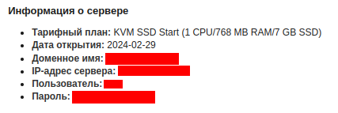
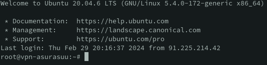

+++
title = 'Личный VPN по цене шаурмы'
date = 2024-03-04T18:29:25+06:00
draft = true
tags = ['vpn']
categories = ['туториалы']
+++

В реалиях 23-24 годов мы все больше и больше стали использовать VPN сервисы, дабы получить доступ к заблокированны сервисам.

Но публичные VPN сервисы и приложения могут не только передавать трафик, но так же одним глазком подглядывать вашу личную информацию. Так что во избежания проблем мы поднимим личный VPN по цене шаурмы (примерно 200 руб) за 4 простых шага.

## 1 шаг - Аренда зарубежного сервера

Лично я использую провайдера - [ihor.ru](https://www.ihor-hosting.ru/?from=411140). По одной простой причине: Он использует сервера находящиеся в Финляндии и Москве, а так же принимает оплату рублями.

Вы можете использоваться любого хостинг провайдера, который предоставляет возможность арендовать VPS/VDS на загроничных серверах. Это не критично, но первый шаг я буду показывать на примере своего провайдера.

И так, мы перешли на сайт выбранного хостинг провайдера и можем выбирать необходимую нам услугу. Вспомним, что было сказано ранее и выбираем "VDS/VPS хостинг".


Дальше нам нужно выбрать тарифный план. Выбирайте на свое усмотрение, но нам хватит и самого простого. Убедитесь, что сервера находятся не на теретории России (должен быть соответсвующий переключатель).

Если вы пойдете по шагам, которые далее предложит провадер - то с легкостью сможете арендовать сервер.

## 2 шаг - Подключаемся

После удачного оформления сервера нам должны прийти реквизиты для работы с сервером.



Нам нужно подключиться к консоли сервера. Некоторые провайдеры предоставляеют доступ к консоли из web-интерфейса, но мы будем подключаться из нашей рабочей среды.

### Windows

Если вы являетесь пользователем Windows, то вам понадобиться программа [Putty](https://www.putty.org/).

Устанавливается как и другие программы. Далее вставляем полученные реквизиты в поля с такими же наименованиями и получаем доступ к консоли сервера.

### Linux / MacOS

Если же вы пользователь Linux / MacOS, то вам потребует терминал.

Открываем терминал на вашем устройстве и вводим комманду:

```
ssh [имя пользователя]@[ip адрес сервера]
```
Далее потребуется ввести пароль. Он отображаться не будет. После ввода - нажимем Enter и ждем. Если вы все сделали все правильно, то должны получиться, что то похожее:



## 3 шаг - Поднимаем VPN

Поздравляю! Самое сложное позади. Далее установим OpenVPN, воспользовавшись готовым скриптом для его установки.

Введем в консоли сервера:
```
wget https://git.io/vpn -O openvpn-install.sh
```

Это шелл скрипт, который нам все установит. Если есть желание - можете поковыряться в файле.

Теперь запустим скрипт:
```
bash openvpn-install.sh
```

Если вы активируете его в первый раз, то он спросит несколько вопросов. Если вы разбираетесь, то выбирайте на свое усмотрение. Если нет - выбирайте, что помечено звездочкой.
В последующие раз использования скрипта - вам будет предоставлена возможность сгенерировать ключи для других пользователей.

Поздравляю! Теперь можно пользоваться. Осталось только перетащить сгенерированный ключ к себе на устройтво. Способы отлючаются в зависимости от ОС.

## Windows

На Windows можно использовать программу [FileZilla](https://www.filezilla.ru/). Просто подключаемся как в Putty и перетаскиваем в локальное хранилище.

## Linux / MacOS

В локальном терминале пишем команду:

```
scp [имя пользователя]@[ip адрес сервера]:[путь до ключа с именем ключа и расширением] [путь на локальной машине для сохранения]
```

Если вы все сделали правильно, то на вашем устройстве должен лежать файл с расширением ovpn.

## 4 шаг - Подключаем устройство и наслаждаемся

Остальсь установить клиент на наше устройство и применить наш ключ.

### Для Windows

Устанавливаем [OpenVPN](https://openvpn.net/community-downloads/) с официального сайта. И ищем там "Импорт файла конфигурации".

### Для Linux (на примере manjaro)

Вводим команду для установки:
```
sudo pacman -S networkmanager-openvpn
```

Далее в настройках сети будет возможность импортировать файл конфигурации.

Либо можем подключит использовать через терминал:

```
sudo nmcli connection import type openvpn file /path/to/your.ovpn
```

Для использования подключения;

```
nmcli connection up <connection-name>
```

### Для мобильных устройств

Ищем в вашем магазине приложений OpenVPN Client.

Закидываем ключ на устройство и открываем его при помощи установленного клиента.

---

Поздравляю! Теперь у вас появился личный VPN без реклам и по цене шаурмы.

Удачного использования!
